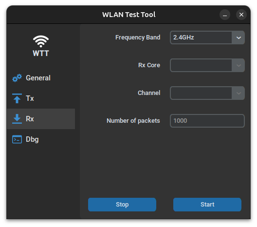

# wlan-test-tool 
A graphical control tool for WLAN testing. Makes it possible to control the WLAN PHY parameters and is useful for RF tests and certification activities.
Simplifies setup of only valid IEEE 802.11 PHY combinations.
Note: Requires wlan test firmware! 
It also requires control scripts for the specific WLAN chip. The chip control script can not be supplied here due to confidentiality. This is just a wrapper GUI for the control script.

Clone the repo:
```bash
git clone git@github.com:johanssonK/wlan-test-tool.git
```

### Prepare a virtual environment and install dependencies
Tested on Ubuntu 24.04
* tkinter and customtkinter
```bash
sudo apt install python3.12-venv 
sudo apt install python3-tk

# create a virutal env and load it
python3 -m venv wtt
source ./wtt/bin/activate

# install local dependencies
pip3 install customtkinter
pip3 install CTkMenuBar
pip3 install CTkMessagebox
```

### Run the program from the virtual env

```bash
python3 main.py
```

### Using the program
The communication to the DUT is configured in the "general" tab\


Transmitter control:\
  

Receiver control:\
  

Icons by: https://icons8.com/
